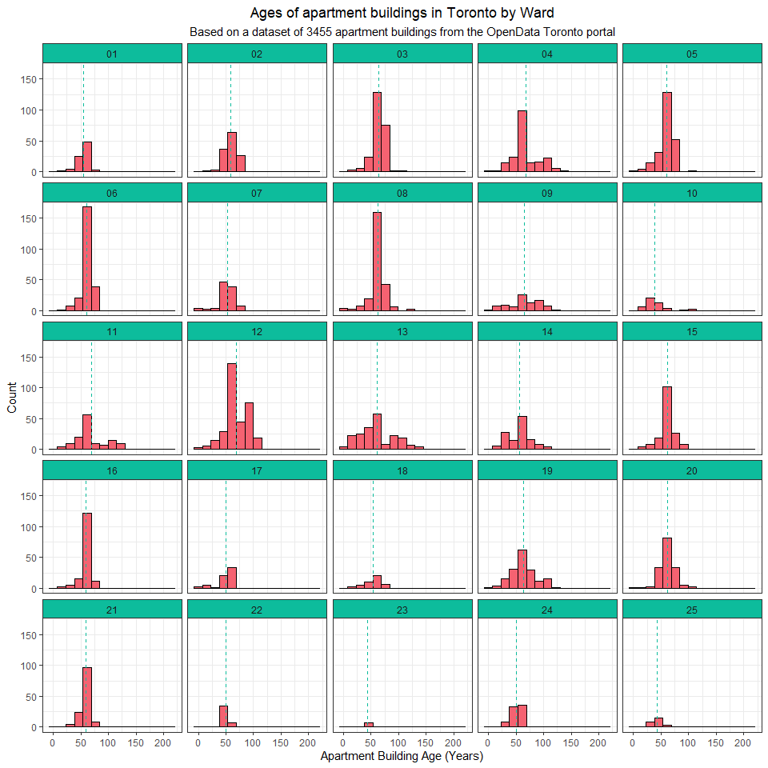
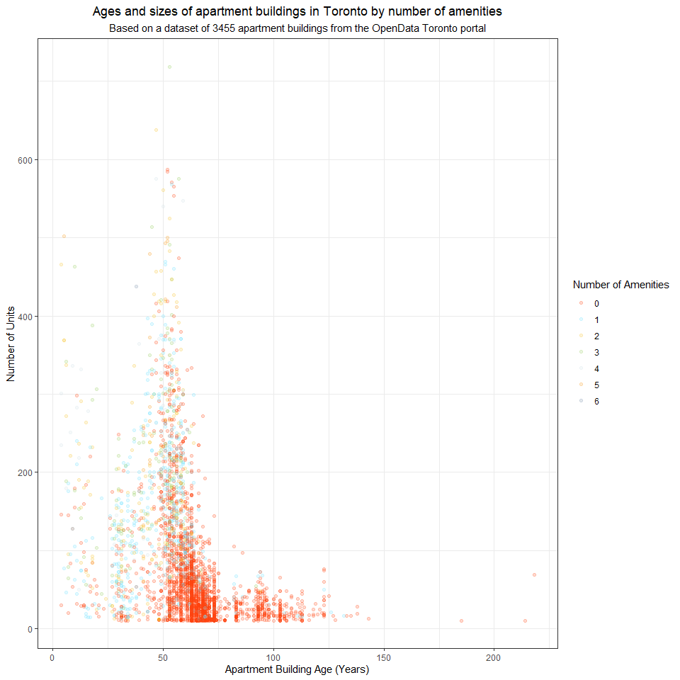
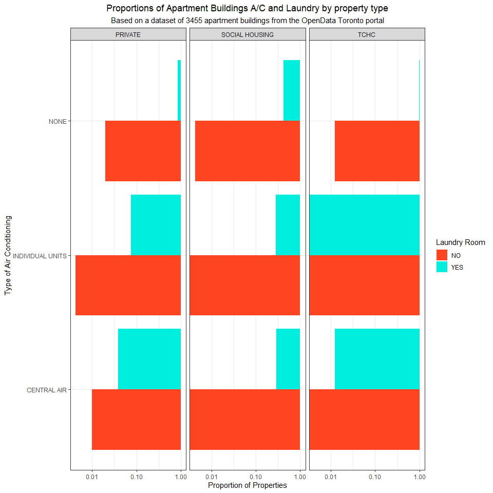
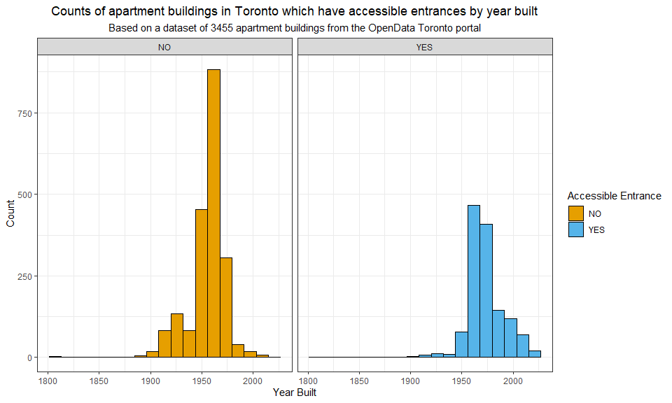
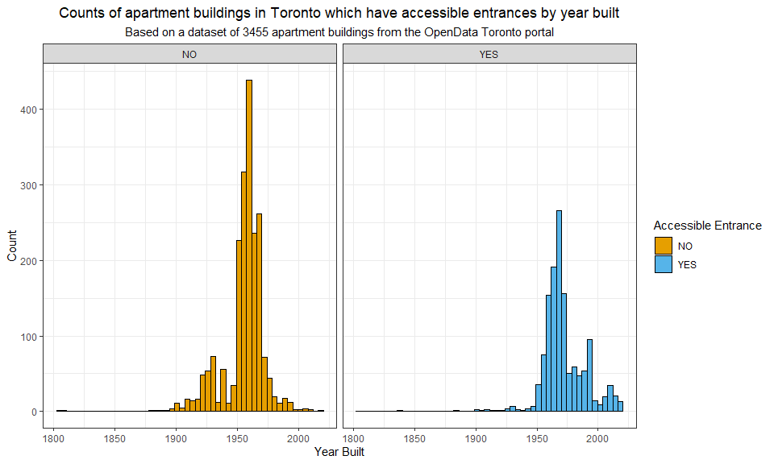
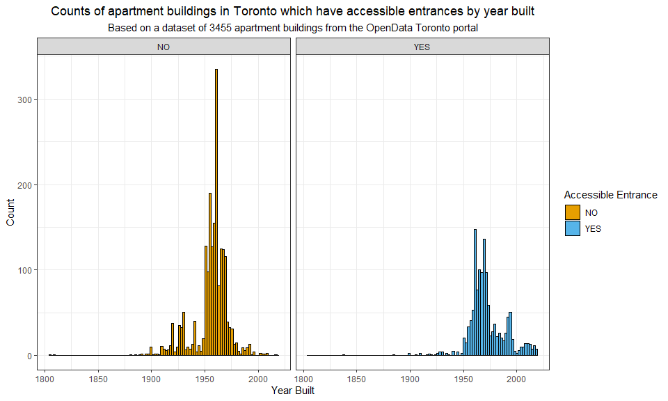

Mini Data Analysis Milestone 2
================

*To complete this milestone, you can either edit [this `.rmd`
file](https://raw.githubusercontent.com/UBC-STAT/stat545.stat.ubc.ca/master/content/mini-project/mini-project-2.Rmd)
directly. Fill in the sections that are commented out with
`<!--- start your work here--->`. When you are done, make sure to knit
to an `.md` file by changing the output in the YAML header to
`github_document`, before submitting a tagged release on canvas.*

# Welcome to the rest of your mini data analysis project!

In Milestone 1, you explored your data. and came up with research
questions. This time, we will finish up our mini data analysis and
obtain results for your data by:

- Making summary tables and graphs
- Manipulating special data types in R: factors and/or dates and times.
- Fitting a model object to your data, and extract a result.
- Reading and writing data as separate files.

We will also explore more in depth the concept of *tidy data.*

**NOTE**: The main purpose of the mini data analysis is to integrate
what you learn in class in an analysis. Although each milestone provides
a framework for you to conduct your analysis, it’s possible that you
might find the instructions too rigid for your data set. If this is the
case, you may deviate from the instructions – just make sure you’re
demonstrating a wide range of tools and techniques taught in this class.

# Instructions

**To complete this milestone**, edit [this very `.Rmd`
file](https://raw.githubusercontent.com/UBC-STAT/stat545.stat.ubc.ca/master/content/mini-project/mini-project-2.Rmd)
directly. Fill in the sections that are tagged with
`<!--- start your work here--->`.

**To submit this milestone**, make sure to knit this `.Rmd` file to an
`.md` file by changing the YAML output settings from
`output: html_document` to `output: github_document`. Commit and push
all of your work to your mini-analysis GitHub repository, and tag a
release on GitHub. Then, submit a link to your tagged release on canvas.

**Points**: This milestone is worth 50 points: 45 for your analysis, and
5 for overall reproducibility, cleanliness, and coherence of the Github
submission.

**Research Questions**: In Milestone 1, you chose two research questions
to focus on. Wherever realistic, your work in this milestone should
relate to these research questions whenever we ask for justification
behind your work. In the case that some tasks in this milestone don’t
align well with one of your research questions, feel free to discuss
your results in the context of a different research question.

# Learning Objectives

By the end of this milestone, you should:

- Understand what *tidy* data is, and how to create it using `tidyr`.
- Generate a reproducible and clear report using R Markdown.
- Manipulating special data types in R: factors and/or dates and times.
- Fitting a model object to your data, and extract a result.
- Reading and writing data as separate files.

# Setup

Begin by loading your data and the tidyverse package below:

``` r
library(datateachr) # <- might contain the data you picked!
library(tidyverse)
library(lubridate)

# Load the dataset
apts <- datateachr::apt_buildings
```

# Task 1: Process and summarize your data

From milestone 1, you should have an idea of the basic structure of your
dataset (e.g. number of rows and columns, class types, etc.). Here, we
will start investigating your data more in-depth using various data
manipulation functions.

### 1.1 (1 point)

First, write out the 4 research questions you defined in milestone 1
were. This will guide your work through milestone 2:

<!-------------------------- Start your work below ---------------------------->

Three of the four research questions which I wrote in Milestone 1 are
the following:

- *As the City of Toronto grows, are new apartment buildings more
  commonly built in areas which are further from the downtown core?
  Where are new apartment buildings being built in the City of Toronto?*
- *Is there a correlation between the size of a building any the number
  of amenities offered in the building? Are these values correlated with
  newer buildings in general?*
- *How do privately-owned apartment buildings differ from the buildings
  which are owned by the City of Toronto? Are certain features more
  common in privately-owned buildings than in Social Housing and TCHC
  buildings?*

The fourth question which I wrote in Milestone 1 (Research Question 2)
is very similar to the third question listed above and it would be
difficult to create a plot that meaningfully displays the relationships
between the categorical variables which I had chosen to examine. To
circumvent this problem, I have created a new research question to
analyze instead:

- *Has there been an increase in accessible features (such as accessible
  entrances, accessible parking spots, and elevators) in newly-built
  apartment buildings in Toronto compared to older buildings?*

<!----------------------------------------------------------------------------->

Here, we will investigate your data using various data manipulation and
graphing functions.

### 1.2 (8 points)

Now, for each of your four research questions, choose one task from
options 1-4 (summarizing), and one other task from 4-8 (graphing). You
should have 2 tasks done for each research question (8 total). Make sure
it makes sense to do them! (e.g. don’t use a numerical variables for a
task that needs a categorical variable.). Comment on why each task helps
(or doesn’t!) answer the corresponding research question.

Ensure that the output of each operation is printed!

Also make sure that you’re using dplyr and ggplot2 rather than base R.
Outside of this project, you may find that you prefer using base R
functions for certain tasks, and that’s just fine! But part of this
project is for you to practice the tools we learned in class, which is
dplyr and ggplot2.

**Summarizing:**

1.  Compute the *range*, *mean*, and *two other summary statistics* of
    **one numerical variable** across the groups of **one categorical
    variable** from your data.
2.  Compute the number of observations for at least one of your
    categorical variables. Do not use the function `table()`!
3.  Create a categorical variable with 3 or more groups from an existing
    numerical variable. You can use this new variable in the other
    tasks! *An example: age in years into “child, teen, adult, senior”.*
4.  Compute the proportion and counts in each category of one
    categorical variable across the groups of another categorical
    variable from your data. Do not use the function `table()`!

**Graphing:**

6.  Create a graph of your choosing, make one of the axes logarithmic,
    and format the axes labels so that they are “pretty” or easier to
    read.
7.  Make a graph where it makes sense to customize the alpha
    transparency.

Using variables and/or tables you made in one of the “Summarizing”
tasks:

8.  Create a graph that has at least two geom layers.
9.  Create 3 histograms, with each histogram having different sized
    bins. Pick the “best” one and explain why it is the best.

Make sure it’s clear what research question you are doing each operation
for!

<!------------------------- Start your work below ----------------------------->

#### Anomalous Data

Before we begin to develop our plots and summaries to answer the four
questions listed above, we will first do some work to remove and fix a
few anomalous values in the dataset to ensure that these do not throw
off our analyses.

``` r
apts_anomalous <- apts %>%
  filter(no_of_units > 1000 | no_of_units == 0 | no_of_storeys == 0 | ward == "YY") %>%
  select(id, no_of_units, no_of_storeys, site_address, ward)
head(apts_anomalous)
```

    ## # A tibble: 5 × 5
    ##      id no_of_units no_of_storeys site_address       ward 
    ##   <dbl>       <dbl>         <dbl> <chr>              <chr>
    ## 1 10529           0             0 49  MC CAUL ST     10   
    ## 2 11288           0             0 25  SAN ROMANOWAY  07   
    ## 3 11947          49             0 2  CLARENDON AVE   12   
    ## 4 12036         369            43 561  SHERBOURNE ST YY   
    ## 5 13219        4111            23 66  ISABELLA ST    13

The anomalous entries in the dataset are shown above. - The first
building (`id` 12036) has the ward listed as “YY”, which is not a real
ward in the City of Toronto. Based on [this
tool](https://www.toronto.ca/city-government/data-research-maps/neighbourhoods-communities/ward-profiles/),
we find that this building is located in Ward 13. - The second building
(`id` 13219) supposedly has 4111 units, which is more than five times as
many units as the second-largest building the dataset. As we do not know
the true number of units in this building, we will remove this outlier
from the dataset entirely instead of imputing this value. - There are
three buildings (`id` 10529, 11288, and 11947) which are listed as
having 0 storeys (two of these also have 0 units), which does not make
sense for an apartment building. As we do not know the true number of
storeys for these buildings, we will remove these observations from the
dataset entirely.

``` r
# Fix the ward in the first anomalous observation, 
# and remove the other three observations from the dataset
apts <- apts %>%
  filter(no_of_units < 4000) %>% 
  filter(no_of_storeys > 0) %>%
  mutate(ward = if_else(ward == "YY", "13", ward))
```

#### Research Question 1

To examine the first question (where are new apartment buildings being
built in Toronto), we can look at the distribution of the age of
apartment buildings in Toronto by ward. To do this, we will define a new
variable called `building_age` which represents the number of years
since a building was built, and we will then summarize this new variable
(with the data grouped by the `ward`) to examine which areas of the city
have older buildings and which areas have many newly-built buildings.

The wards in the City of Toronto are the electoral districts for
municipal elections, where each ward is represented by a city
councillor, so the `ward` variable in the dataset is an excellent proxy
for the area/neighbourhood where an apartment building is located.

``` r
curr_year = year(today()) # Current year

# Create the building_age variable
apts <- apts %>%
  mutate(building_age = curr_year - year_built)

# Summarize age of apartment buildings by ward
building_age_summary <- apts %>% 
  # Group by ward
  group_by(ward) %>% 
  # Remove missing observations
  drop_na(building_age) %>%
  # Calculate summary statistics for the ages of apartment buildings
  summarise(no_of_buildings = n(),
            newest_building_age = min(building_age),
            median_building_age = quantile(building_age, 0.50),
            oldest_building_age = max(building_age),
            mean_building_age = mean(building_age),
            building_age_range = oldest_building_age - newest_building_age)

# Show the summary table created above
print(building_age_summary)
```

    # A tibble: 25 × 7
       ward  no_of_buildings newest_building_age median_building_age
       <chr>           <int>               <dbl>               <dbl>
     1 01                 81                  16                56  
     2 02                130                  12                57.5
     3 03                240                  11                66  
     4 04                198                   6                63  
     5 05                232                   5                63  
     6 06                236                  18                63  
     7 07                101                   6                53  
     8 08                241                   4                65  
     9 09                 87                   7                64  
    10 10                 46                  10                36  
    # ℹ 15 more rows
    # ℹ 3 more variables: oldest_building_age <dbl>, mean_building_age <dbl>,
    #   building_age_range <dbl>

As we can see in the table above, there are only 6 wards in Toronto
which had an apartment building constructed in the last 5 years
(assuming that the dataset is up to date as of 2023), which are Ward 5,
Ward 8, Ward 12, Ward 13, Ward 17, and Ward 24. We can also see that
there is a large discrepancy in the number of apartment buildings per
ward. For example, Ward 12 has 330 apartment buildings, while Ward 23
has only 8.

Next, we will create a collection of histograms displaying the
distribution of apartment building ages by ward. This will help us get a
visual intuition of the data which was summarized in the table above.

``` r
# Create a plot of building age density by ward
apts %>%
  # Remove missing observations
  drop_na(building_age) %>%
  # Create histograms of building age by ward
  ggplot(aes(x = building_age)) +
    geom_histogram(fill = "#F56271", color = "black", bins = 15) +
    theme_bw() +
    # Split the histograms by ward
    facet_wrap(~ward) +
    # Add a dotted line to each histogram showing the mean building age
    geom_vline(data = building_age_summary, aes(xintercept = mean_building_age),
               color = "#0DBC9C", linetype = "dashed") +
    labs(x = "Apartment Building Age (Years)", y = "Count",
         title = "Ages of apartment buildings in Toronto by Ward",
         subtitle = "Based on a dataset of 3455 apartment buildings from the OpenData Toronto portal") +
    theme(plot.title = element_text(hjust = 0.5), plot.subtitle = element_text(hjust = 0.5),
          strip.background = element_rect(fill = "#0DBC9C"))
```

<!-- -->

Based on the plots above, we see that the different wards in the City of
Toronto do have different distributions among the ages of their
apartment buildings, although most of distributions are rather similar
overall, as a majority of these histograms are unimodal shapes with a
mode of approximately 50 years, and the dotted green lines (representing
the mean age per ward) are also all quite close to thos 50-year mark.

#### Research Question 2

To examine if there is any correlation between the number of amenities
which an apartment building has and the size/age of the building, we
will first need to find the number of amenities each building.

The `amenities` column in the apartment buildings dataset stores the
amenities which the building has as a comma-separated list, which means
that we can count the number of commas in the `amenities` column to
determine the number of amenities which the building has. We will save
this as a variable called `no_of_amenities` as a new column in the
dataset.

``` r
# Create the no_of_amenities variable in the dataset
apts <- apts %>%
  mutate(no_of_amenities = if_else(is.na(amenities), 0, 
                                   stringr::str_count(amenities, ",") + 1))
```

Next, we can group the apartment buildings in the City of Toronto based
on how many amenities the building has, in order to look at the
distribution of the number of units per building based on the number of
amenities in the building. This will help us see if there are any
quantifiable relationships between these two variables.

``` r
# Summarize number of units in apartment buildings by number of amenities
amenities_summary <- apts %>% 
  # Group by number of amenities
  group_by(no_of_amenities) %>% 
  # Remove missing observations
  drop_na(no_of_units) %>%
  # Calculate summary statistics for the ages of apartment buildings
  summarise(no_of_buildings = n(),
            fewest_units = min(no_of_units),
            median_units = quantile(no_of_units, 0.50),
            most_units = max(no_of_units),
            mean_units = mean(no_of_units),
            range_of_units = most_units - fewest_units)

# Show the summary table created above
print(amenities_summary)
```

    # A tibble: 7 × 7
      no_of_amenities no_of_buildings fewest_units median_units most_units
                <dbl>           <int>        <dbl>        <dbl>      <dbl>
    1               0            2515           10          38         587
    2               1             511           10         118         568
    3               2             212           12         146.        638
    4               3             131           26         186         719
    5               4              52           50         235         575
    6               5              26           92         256         502
    7               6               4          101         152.        438
    # ℹ 2 more variables: mean_units <dbl>, range_of_units <dbl>

Based on the table above, we see that a vast majority of the apartment
buildings in Toronto have 0 amenities or 1 amenity only, with a
relatively small number of buildings having 2 or more amenities. The
“fewest units” variable seems to be strongly correlated with the number
of amenities in the building, which makes sense, as a building with many
amenities would likely house a lot of people.

Next, we will create a plot of the number of amenities in an apartment
building, the number of units in the building, and the age of the
building, to visually examine how these three variables are correlated
with one another. To do this, we will create a scatter plot with the
building’s age on the x-axis, the number of units on the y-axis, and the
number of amenities will be reflected in colour of the points on the
scatter plot.

This will help us visualize the data which is displayed in the table
created above, and additionally, it will help us examine the correlation
between all three of these variables (`no_of_units`, `building_age`, and
`no_of_amenities`) instead of restricting us to looking at only two
variables at a time.

``` r
# Create a scatter plot of building age and number of units in the building
apts %>%
  # Remove missing observations
  drop_na(no_of_units, building_age, no_of_amenities) %>%
  # Create a scatter plot of number of units and building age
  ggplot(aes(x = building_age, y = no_of_units)) +
    # Change color of the points based on number of amenities
    geom_point(aes(color = as.factor(no_of_amenities)), alpha = 0.2) +
    scale_color_manual(values = paletteer::paletteer_d("ggsci::legacy_tron", n = 7)) +
    theme_bw() +
    labs(x = "Apartment Building Age (Years)", y = "Number of Units", color = "Number of Amenities",
         title = "Ages and sizes of apartment buildings in Toronto by number of amenities",
         subtitle = "Based on a dataset of 3455 apartment buildings from the OpenData Toronto portal") +
    theme(plot.title = element_text(hjust = 0.5), plot.subtitle = element_text(hjust = 0.5))
```

<!-- -->

Based on this scatter plot, we see that many of the buildings which are
over 50 years old have (comparably) few units in the building, and
almost all of these buildings have zero amenities offered, with a few
one-amenity buildings among them.

On the other hand, a majority of the newer buildings have a larger
number of units, and these buildings also tend to have some amenities,
as we can see a much smaller proportion of red dots as we move leftward
on the x-axis, especially compared to the large “red wave” among
apartment buildings which are 60-65 years old.

Based on the results above, it would seem that the age of a building is
correlated with the number of units in the building, as the shape of the
scatter plot is definitely indicative of some negative relationship
between these two variables (i.e. as the age of the building increases,
the average number of units in the building decreases). Based on the
“color gradient” in this plot, we can also see that there is a
correlation between the age of an apartment building and the number of
amenities which it has, as the older buildings tend to have no
amenities, whereas the newer buildings have some amenities.

#### Research Question 3

We want to examine the differences between privately-owned apartment
buildings and those which are deemed to be Social Housing or are owned
by TCHC (Toronto City Housing Corporation). To examine these
differences, we can look at the proportion of apartment buildings in
each of these three categories which have certain features, such as air
conditioning, balconies, lockers/storage areas, fire alarms, or laundry
rooms. In particular, we will look at the proportion of apartment
buildings which have (or do not have) air conditioning, and which have
or do not have laundry rooms. We chose to use these two features as both
of them are not strictly necessary, but they can greatly improve a
person’s quality of life if these features are present in the building.

This will help us quantify whether there are any noticeable differences
between apartment buildings of different property types, as we will be
able to see the proportions of properties with different types of air
conditioning and laundry room availability for the tenants in the
building.

``` r
# Create a subset of the dataset which only has our desired features
apts_features <- apts %>%
  select(property_type, air_conditioning, laundry_room) %>%
  drop_na() %>%
  # Convert the three variables to factors 
  mutate(property_type = as.factor(property_type),
         air_conditioning = as.factor(air_conditioning),
         laundry_room = as.factor(laundry_room))

# Count occurrences of each combination of the three variables
features_summary <- apts_features %>%
  group_by(pick(everything()), .drop = F) %>%
  summarise(count = n()) %>%
  ungroup()

# Compute proportion of each combination occurring (with respect to the property type)
features_summary <- features_summary %>% 
  group_by(property_type) %>%
  mutate(prop = count/sum(count)) %>%
  select(-c(count))

head(features_summary)
```

    # A tibble: 6 × 4
    # Groups:   property_type [1]
      property_type air_conditioning laundry_room    prop
      <fct>         <fct>            <fct>          <dbl>
    1 PRIVATE       CENTRAL AIR      NO           0.00999
    2 PRIVATE       CENTRAL AIR      YES          0.0389 
    3 PRIVATE       INDIVIDUAL UNITS NO           0.00428
    4 PRIVATE       INDIVIDUAL UNITS YES          0.0752 
    5 PRIVATE       NONE             NO           0.0196 
    6 PRIVATE       NONE             YES          0.852  

As we can see in the table displayed above, there do appear to be some
differences between the proportions of buildings with specified types of
air conditioning and laundry rooms with respect to the property type.
For example, only 3.89% of privately-owned apartment buildings have
central air conditioning and a laundry room, compared to 29.36% of
social housing apartment buildings.

Next, we will use bar plots to visualize these proportions across the
three different property types. Because many of the proportions are
miniscule, we will use a logarithmic scale on the y-axis to allow us to
more readily compare these values with one another.

``` r
# Create a stacked bar plot
features_summary %>%
  ggplot(aes(x = air_conditioning, y = prop, fill = laundry_room)) +
    geom_col(position = "dodge") +
    scale_y_log10() +
    facet_wrap(~property_type) +
    theme_bw() +
    scale_fill_manual(values = c("#FF4422", "#00EEDD")) +
    labs(x = "Type of Air Conditioning", y = "Proportion of Properties", fill = "Laundry Room",
         title = "Proportions of Apartment Buildings A/C and Laundry by property type",
         subtitle = "Based on a dataset of 3455 apartment buildings from the OpenData Toronto portal") +
    theme(plot.title = element_text(hjust = 0.5), plot.subtitle = element_text(hjust = 0.5)) +
    coord_flip()
```

<!-- -->

Although the plot above does demonstrate the proportions which were
calculated in the table displayed previously, the plot shown is slightly
difficult to read, as a larger bar actually reflects that there is a
smaller proportion of apartment buildings with the selected
characteristics, due to the logarithmic nature of the axis. Unlike a
“normal” bar/column plot, a smaller bar represents a higher proportion
of the overall values.

Even though this plot is a bit difficult to read, it is still very
useful at answering the initial research question. Based on the plots
above, we see that the most common “combination” by far is an apartment
building with no A/C which does have a laundry room, as this is far and
away the most commonly-occurring type of apartment building across all
three property types. There are also other noticeable distinctions
between these buildings, such as the fact that social housing buildings
are the most likely to have air conditioning and also have a laundry
room, which is (likely) desirable for many people, as these features are
both pretty nice to have in your living space.

#### Research Question 4

To examine how the amount of accessible features in apartment buildings
has changed over time, we can look at the availability of barrier-free
entrances to the building, which is stored in the
`barrier_free_accessibilty_entr` variable. In particular, we can examine
the proportion of buildings built in a specific time period which have
barrier-free and accessible entrances, which will serve as a proxy for
determining the amount of newly-built accessible apartment buildings in
the City of Toronto.

In order to compute these proportions, we will need to group together
some sets of years, as the proportions would likely be too volatile and
high-variance if we computed the proportion of buildings with accessible
entrances in each year. Using the `cut` function, we can segment the
buildings into groups based on which 20-year period they were built.

``` r
# Create the list of cuts for the year_built variable (every 20 years from 1805-2025)
year_cuts <- seq(min(apts$year_built, na.rm = T), 
                 max(apts$year_built, na.rm = T) + 20, by = 20)

# Create a subset of the dataset which only has our desired features
accessible_apts <- apts %>%
  select(year_built, barrier_free_accessibilty_entr) %>%
  drop_na() %>%
  mutate(barrier_free_accessibilty_entr = as.factor(barrier_free_accessibilty_entr)) %>%
  mutate(year_group = cut(year_built, year_cuts, 
                          include.lowest = TRUE, dig.lab = 4))
  
# Compute number of accessible/not accessible buildings 
# per 20-year construction period
accessible_apts_summary <- accessible_apts %>%
  group_by(year_group, barrier_free_accessibilty_entr, .drop = FALSE) %>%
  summarise(no_of_buildings = n()) %>%
  ungroup()

# Compute proportion of buildings which are accessible
accessible_apts_summary <- accessible_apts_summary %>%
  group_by(year_group) %>%
  mutate(prop_accessible = no_of_buildings/sum(no_of_buildings),
         total_buildings = sum(no_of_buildings)) %>%
  select(-c(no_of_buildings)) %>%
  # Only choose proportion that are acceptable (we don't need both)
  filter(as.character(barrier_free_accessibilty_entr) == "YES") %>%
  # Remove one NaN value (caused by 0/0 division)
  filter(!is.nan(prop_accessible)) %>%
  ungroup()

accessible_apts_summary
```

    # A tibble: 10 × 4
       year_group  barrier_free_accessibilty_entr prop_accessible total_buildings
       <fct>       <fct>                                    <dbl>           <int>
     1 [1805,1825] YES                                     0                    2
     2 (1825,1845] YES                                     1                    1
     3 (1865,1885] YES                                     0.333                3
     4 (1885,1905] YES                                     0.154               26
     5 (1905,1925] YES                                     0.0690             116
     6 (1925,1945] YES                                     0.106              226
     7 (1945,1965] YES                                     0.270             1702
     8 (1965,1985] YES                                     0.585              972
     9 (1985,2005] YES                                     0.814              236
    10 (2005,2025] YES                                     0.929               85

As we can see from the table above, the proportion of apartment
buildings in the City of Toronto which have barrier-free accessible
entrances seems to have started drastically shooting up in the past 120
years. Although the 20-year period with the highest proportion of
accessible buildings is actually the period from 1825-1845, there is
only one apartment building which was constructed in this timeframe, and
we do not know whether the building has been “retrofitted” since, so
this value may not be a reliable marker of the true proportion of
accessible buildings built in that period of time.

In addition to these proportions, we can also use histograms to examine
the distribution of apartment buildings which have or do not have
accessible entrances. We can do this by creating histograms and using
the `facet_wrap` function to split our dataset based on whether the
building has an accessible entrance or not.

``` r
# Create histograms of the year when buildings were built, and 
# whether or not they have accessible/barrier-free entrances
accessible_apts %>%
  ggplot(aes(x = year_built, fill = barrier_free_accessibilty_entr)) +
    geom_histogram(color = "black", bins = 19) +
    scale_fill_manual(values = c("#E69F00", "#56B4E9")) +
    theme_bw() +
    labs(x = "Year Built", y = "Count", fill = "Accessible Entrance",
         title = "Counts of apartment buildings in Toronto which have accessible entrances by year built",
         subtitle = "Based on a dataset of 3455 apartment buildings from the OpenData Toronto portal") +
    theme(plot.title = element_text(hjust = 0.5), plot.subtitle = element_text(hjust = 0.5)) +
    facet_wrap(~barrier_free_accessibilty_entr)
```

<!-- -->

``` r
# Create histograms of the year when buildings were built, and 
# whether or not they have accessible/barrier-free entrances
accessible_apts %>%
  ggplot(aes(x = year_built, fill = barrier_free_accessibilty_entr)) +
    geom_histogram(color = "black", bins = 52) +
    scale_fill_manual(values = c("#E69F00", "#56B4E9")) +
    theme_bw() +
    labs(x = "Year Built", y = "Count", fill = "Accessible Entrance",
         title = "Counts of apartment buildings in Toronto which have accessible entrances by year built",
         subtitle = "Based on a dataset of 3455 apartment buildings from the OpenData Toronto portal") +
    theme(plot.title = element_text(hjust = 0.5), plot.subtitle = element_text(hjust = 0.5)) +
    facet_wrap(~barrier_free_accessibilty_entr)
```

<!-- -->

``` r
# Create histograms of the year when buildings were built, and 
# whether or not they have accessible/barrier-free entrances
accessible_apts %>%
  ggplot(aes(x = year_built, fill = barrier_free_accessibilty_entr)) +
    geom_histogram(color = "black", bins = 105) +
    scale_fill_manual(values = c("#E69F00", "#56B4E9")) +
    theme_bw() +
    labs(x = "Year Built", y = "Count", fill = "Accessible Entrance",
         title = "Counts of apartment buildings in Toronto which have accessible entrances by year built",
         subtitle = "Based on a dataset of 3455 apartment buildings from the OpenData Toronto portal") +
    theme(plot.title = element_text(hjust = 0.5), plot.subtitle = element_text(hjust = 0.5)) +
    facet_wrap(~barrier_free_accessibilty_entr)
```

<!-- -->
Based on the histograms above, we can see that a vast majority of the
buildings which do not have accessible entrances were built in the
period from 1950 to 1970, although there is a sizeable chunk of
buildings without accessible entrances which were built in the period
from 1920 to 1950 as well. On the other hand, almost every building with
barrier-free accessible entrances was built in the period after the
1940s, and we additionally wee that starting around the year 1980, the
number of buildings without accessible entrances begins to taper off
quite quickly, while the number of buildings which are accessible
continues to remain (relatively) stable.

Overall, these plots look pretty similar to the general histograms of
the number of buildings built per year, but we can see that there is a a
slight “shift” in the data between these two histograms, which
represents that a higher proportion of newly-built apartment buildings
have accessible entrances, which we also discovered in the table shown
prior.

The histograms displayed above were created with 19, 52, and 105 bins,
respectively, and based on these plots, it seems like the 52-bin
histogram is ideal for displaying this specific relationship. Although
the 19-bin histogram is easily-digestible, it is a bit too “simplistic”
in terms of how large the groups are, and the largest bin in the dataset
has more than 800 buildings, which is roughly a quarter of the entire
`apt_buildings` dataset. On the other hand, the 105-bin histogram is too
detailed and it seems like there is too much fluctuation between
consecutive bins, which may have occurred because the construction
industry is not always steady from year to year, and there could be high
variance. The 52-bin histogram strikes a good balance between these two
“extremes”, because we are able to see patterns in the data while also
not being overly susceptible to variance in the dataset.

<!----------------------------------------------------------------------------->

### 1.3 (2 points)

Based on the operations that you’ve completed, how much closer are you
to answering your research questions? Think about what aspects of your
research questions remain unclear. Can your research questions be
refined, now that you’ve investigated your data a bit more? Which
research questions are yielding interesting results?

<!------------------------- Write your answer here ---------------------------->

Based on the work which I have completed in the previous section, I feel
like I have been able to dig a bit deeper into my selected dataset than
I was able to in Milestone 1, but there are still questions which I
would like to analyze further, and I have also been thinking of some new
questions which interest me as I continue to examine the dataset more
thoroughly.

I intentionally left my research questions somewhat vague during
Milestone 1 so that I could refine them as I continued working on the
Mini Data Analysis project, and I think that these data explorations
have helped me determine which of my questions are yielding good results
and which questions are quite difficult to quantify with the
`apt_buildings` dataset. In particular, I think that the first two
questions which I looked into have a lot of potential for follow-up
questions and further exploration into the data, whereas my other two
questions are not as “rich” as I had initially hoped.

<!----------------------------------------------------------------------------->

# Task 2: Tidy your data

In this task, we will do several exercises to reshape our data. The goal
here is to understand how to do this reshaping with the `tidyr` package.

A reminder of the definition of *tidy* data:

- Each row is an **observation**
- Each column is a **variable**
- Each cell is a **value**

### 2.1 (2 points)

Based on the definition above, can you identify if your data is tidy or
untidy? Go through all your columns, or if you have \>8 variables, just
pick 8, and explain whether the data is untidy or tidy.

<!--------------------------- Start your work below --------------------------->

The dataset which I am using (`apt_buildings`) has 37 variables in
total, so I will only be looking at a small subset of these variables.
The variables which I am selecting are some of the more “basic”
variables pertaining to information about an apartment building, such as
the year when it was built, the number of units and floors, and the
address.

``` r
# Get a subset of 8 variables from the original (unedited by me)
apts_small <- datateachr::apt_buildings %>%
  select(id, site_address, ward, no_of_units, no_of_storeys, 
         year_built, prop_management_company_name, property_type)

# View the subsetted data
head(apts_small)
```

    # A tibble: 6 × 8
         id site_address         ward  no_of_units no_of_storeys year_built
      <dbl> <chr>                <chr>       <dbl>         <dbl>      <dbl>
    1 10359 65  FOREST MANOR RD  17            218            17       1967
    2 10360 70  CLIPPER RD       17            206            14       1970
    3 10361 2651  BLOOR ST W     03             34             4       1927
    4 10362 22  BURNHAMTHORPE RD 03             42             5       1959
    5 10363 18  ANGLESEY BLVD    02             25             4       1943
    6 10364 308  THE KINGSWAY    02             34             4       1952
    # ℹ 2 more variables: prop_management_company_name <chr>, property_type <chr>

``` r
# Create a table of missing observations per column
apts_small_NA <- tibble(variable = colnames(apts_small),
                        missing = colSums(is.na(apts_small)),
                        recorded = colSums(!is.na(apts_small)))
apts_small_NA
```

    # A tibble: 8 × 3
      variable                     missing recorded
      <chr>                          <dbl>    <dbl>
    1 id                                 0     3455
    2 site_address                       0     3455
    3 ward                               0     3455
    4 no_of_units                        0     3455
    5 no_of_storeys                      0     3455
    6 year_built                        13     3442
    7 prop_management_company_name    1363     2092
    8 property_type                      0     3455

Based on the characteristics of the subsetted dataset which are shown
above, the data appears to be incredibly tidy in these columns. There
are a few missing values in the dataset (almost all of which are in the
`prop_management_company_name` variable), but aside from these missing
values, the dataset is almost perfectly tidy, as each row in the dataset
references a different apartment building in the City of Toronto, and
each variable in the dataset stores information relating to a different
aspect of that apartment building.

<!----------------------------------------------------------------------------->

### 2.2 (4 points)

Now, if your data is tidy, untidy it! Then, tidy it back to it’s
original state.

If your data is untidy, then tidy it! Then, untidy it back to it’s
original state.

Be sure to explain your reasoning for this task. Show us the “before”
and “after”.

<!--------------------------- Start your work below --------------------------->

To untidy the data, we will “mess with” most of the variables which are
in the dataset. In particular, we will do the following
transformations: - Replace all occurrences of the value “PRIVATE” in the
`property_type` variable with missing (`NA`) values - Use `pivot_longer`
to put the `site_address` and `ward` variables into the same column,
which is called `location`. - Create the `storeys_units` variable which
is a number that stores the number of storeys and units in a building
simultaneously. - Switch the names of the `year` and `id` columns (but
leave the data itself intact)

The operations listed above will make our data much less tidy, as we
will drastically increase the number of missing values in the dataset,
and we will have two new columns in the dataset which each represent
multiple variables corresponding to the apartment building, instead of
only one value. We will also have two columns whose names do not
accurately represent the data, as the `year` column will consist only of
values approximately 10000 years from now, and the `id` column will have
many repeated values.

``` r
# Print the (mostly) tidy version of the dataset
cat("Original data:")
```

    Original data:

``` r
head(apts_small)
```

    # A tibble: 6 × 8
         id site_address         ward  no_of_units no_of_storeys year_built
      <dbl> <chr>                <chr>       <dbl>         <dbl>      <dbl>
    1 10359 65  FOREST MANOR RD  17            218            17       1967
    2 10360 70  CLIPPER RD       17            206            14       1970
    3 10361 2651  BLOOR ST W     03             34             4       1927
    4 10362 22  BURNHAMTHORPE RD 03             42             5       1959
    5 10363 18  ANGLESEY BLVD    02             25             4       1943
    6 10364 308  THE KINGSWAY    02             34             4       1952
    # ℹ 2 more variables: prop_management_company_name <chr>, property_type <chr>

``` r
# Make the data untidy
apts_small_untidy <- apts_small %>%
  # Remove all "PRIVATE" property type values and make them missing values
  mutate(property_type = if_else(property_type != "PRIVATE", property_type, NA)) %>%
  # Use pivot_longer to turn the site_address and ward variables into the location
  pivot_longer(cols = c(site_address, ward), names_to = "location_type", values_to = "location") %>%
  # Replace the no_of_units and no_of_storeys variables with one number
  mutate(storeys_units = 10000 * no_of_storeys + no_of_units) %>%
  select(-c(no_of_storeys, no_of_units)) %>%
  # Swap the names of the year_built and id variables
  mutate(id_new = year_built) %>%
  mutate(year_built = id) %>%
  mutate(id = id_new) %>%
  select(-c(id_new))

# Print the untidy dataset
cat("Untidy dataset:")
```

    Untidy dataset:

``` r
head(apts_small_untidy)
```

    # A tibble: 6 × 7
         id year_built prop_management_compan…¹ property_type location_type location
      <dbl>      <dbl> <chr>                    <chr>         <chr>         <chr>   
    1  1967      10359 <NA>                     <NA>          site_address  65  FOR…
    2  1967      10359 <NA>                     <NA>          ward          17      
    3  1970      10360 SCHICKEDANZ BROS. PROPE… <NA>          site_address  70  CLI…
    4  1970      10360 SCHICKEDANZ BROS. PROPE… <NA>          ward          17      
    5  1927      10361 <NA>                     <NA>          site_address  2651  B…
    6  1927      10361 <NA>                     <NA>          ward          03      
    # ℹ abbreviated name: ¹​prop_management_company_name
    # ℹ 1 more variable: storeys_units <dbl>

``` r
# Return the dataset back to normal
apts_small_tidy <- apts_small_untidy %>%
  # Swap the names of id and year_built columns back
  mutate(id_new = year_built) %>%
  mutate(year_built = id) %>%
  mutate(id = id_new) %>%
  # Transform storeys_units back into two separate values
  mutate(no_of_storeys = floor(storeys_units/10000)) %>%
  mutate(no_of_units = storeys_units - 10000 * no_of_storeys) %>%
  # Use pivot_wider to go back to site_address and ward variables 
  pivot_wider(names_from = location_type, values_from = location) %>%
  # Replace missing property_type values with "PRIVATE"
  mutate(property_type = if_else(is.na(property_type), "PRIVATE", property_type)) %>%
  # Remove the variables which were not in the original dataset
  select(-c(storeys_units, id_new)) %>%
  # Reorder the columns to get back the original column ordering
  relocate(id, site_address, ward, no_of_units, no_of_storeys, 
           year_built, prop_management_company_name, property_type)

# Print the re-tidied dataset
cat("Re-tidied dataset:\n")
```

    Re-tidied dataset:

``` r
head(apts_small_tidy)
```

    # A tibble: 6 × 8
         id site_address         ward  no_of_units no_of_storeys year_built
      <dbl> <chr>                <chr>       <dbl>         <dbl>      <dbl>
    1 10359 65  FOREST MANOR RD  17            218            17       1967
    2 10360 70  CLIPPER RD       17            206            14       1970
    3 10361 2651  BLOOR ST W     03             34             4       1927
    4 10362 22  BURNHAMTHORPE RD 03             42             5       1959
    5 10363 18  ANGLESEY BLVD    02             25             4       1943
    6 10364 308  THE KINGSWAY    02             34             4       1952
    # ℹ 2 more variables: prop_management_company_name <chr>, property_type <chr>

``` r
# Check that all missing values in the original dataset are still missing and vice-versa
all(is.na(apts_small) == is.na(apts_small_tidy))
```

    [1] TRUE

``` r
# Check that all non-missing values are equal in the original and tidied data
all(drop_na(apts_small) == drop_na(apts_small_tidy)) 
```

    [1] TRUE

<!----------------------------------------------------------------------------->

### 2.3 (4 points)

Now, you should be more familiar with your data, and also have made
progress in answering your research questions. Based on your interest,
and your analyses, pick 2 of the 4 research questions to continue your
analysis in the remaining tasks:

<!-------------------------- Start your work below ---------------------------->

The two research questions which I would like to continue to analyze in
the remainder of the Mini Data Analysis are the following:

1.  *As the City of Toronto grows, are new apartment buildings more
    commonly built in areas which are further from the downtown core?
    Where are new apartment buildings being built in the City of
    Toronto?*
2.  *Is there a correlation between the size of a building any the
    number of amenities offered in the building? Are these values
    correlated with newer buildings in general?*

<!----------------------------------------------------------------------------->

Explain your decision for choosing the above two research questions.

<!--------------------------- Start your work below --------------------------->

I chose to work on the two research questions above because they were
yielding the most interesting and promising results when I was working
on the introductory analyses in Section 1.2 of the project. While I was
creating the plots and graphs for these two questions in Section 1.2, I
felt like I was able to easily come up with follow-up questions and
additional information which I was interested in trying to wrangle out
from the `apt_buildings` dataset, and I did not fel like the third and
fourth questions which I created were able to offer the same amount of
potential for follow-up questions and further investigation.
<!----------------------------------------------------------------------------->

Now, try to choose a version of your data that you think will be
appropriate to answer these 2 questions. Use between 4 and 8 functions
that we’ve covered so far (i.e. by filtering, cleaning, tidying,
dropping irrelevant columns, etc.).

(If it makes more sense, then you can make/pick two versions of your
data, one for each research question.)

<!--------------------------- Start your work below --------------------------->

In my opinion, it would be easier to create two separate versions of the
data, as the variables which would be necessary to answer each of these
questions are quite different from one another. I will be creating two
new datasets; `apt_locations` (storing primarily location-based data),
and `apt_sizes`, which contains data relating to the amenities, size,
and age of the apartment buildings.

Although it is not useful for answering any of our questions which we
outlined above, we will be keeping the `id` variable in both of the new
datasets which we are constructing, as it is a useful variable to have
because it is always able to uniquely identify a row/observation if that
is necessary. Additionally, there are a few variables which we are not
necessarily using in the following sections (such as `property_type`)
which we will also include, as a further analysis of these questions may
opt to include these variables in their analytical summaries.

``` r
# Get a new copy of the apt_buildings dataset
apts <- datateachr::apt_buildings

# Create the apt_locations dataset
apt_locations <- apts %>%
  # Remove the 4000-unit building and the two 0-unit buildings
  filter(between(no_of_units, 1, 1000)) %>%
  filter(no_of_storeys > 0) %>%
  # Select necessary variables
  select(id, site_address, ward, year_built, property_type) %>%
  # Fix the one ward that was incorrectly inputted
  mutate(ward = if_else(ward == "YY", "13", ward)) %>%
  # Recreate the building_age variable 
  mutate(building_age = curr_year - year_built) %>%
  # Remove year_built (we just needed it to get building_age) 
  select(-c(year_built)) %>%
  drop_na()

# Show a few rows of this dataset
head(apt_locations)
```

    # A tibble: 6 × 5
         id site_address         ward  property_type building_age
      <dbl> <chr>                <chr> <chr>                <dbl>
    1 10359 65  FOREST MANOR RD  17    PRIVATE                 56
    2 10360 70  CLIPPER RD       17    PRIVATE                 53
    3 10361 2651  BLOOR ST W     03    PRIVATE                 96
    4 10362 22  BURNHAMTHORPE RD 03    PRIVATE                 64
    5 10363 18  ANGLESEY BLVD    02    PRIVATE                 80
    6 10364 308  THE KINGSWAY    02    PRIVATE                 71

``` r
# Create the apt_sizes dataset
apt_sizes <- apts %>%  
  # Remove the 4000-unit building and the two 0-unit buildings
  filter(between(no_of_units, 1, 1000)) %>%
  filter(no_of_storeys > 0) %>%
  # Select necessary variables
  select(id, amenities, no_of_storeys, no_of_units, year_built, property_type) %>%
  # Recreate the no_of_amenities variable
  mutate(no_of_amenities = if_else(is.na(amenities), 0,
                                   stringr::str_count(amenities, ",") + 1)) %>%
  # Remove amenities (we just needed it to get no_of_amenities)
  select(-c(amenities)) %>% 
  drop_na()

# Show a few rows of this dataset
head(apt_sizes)
```

    # A tibble: 6 × 6
         id no_of_storeys no_of_units year_built property_type no_of_amenities
      <dbl>         <dbl>       <dbl>      <dbl> <chr>                   <dbl>
    1 10359            17         218       1967 PRIVATE                     1
    2 10360            14         206       1970 PRIVATE                     1
    3 10361             4          34       1927 PRIVATE                     0
    4 10362             5          42       1959 PRIVATE                     0
    5 10363             4          25       1943 PRIVATE                     0
    6 10364             4          34       1952 PRIVATE                     0

# Task 3: Modelling

## 3.0 (no points)

Pick a research question from 1.2, and pick a variable of interest
(we’ll call it “Y”) that’s relevant to the research question. Indicate
these.

<!-------------------------- Start your work below ---------------------------->

**Research Question**: *Is there a correlation between the size of a
building any the number of amenities offered in the building? Are these
values correlated with newer buildings in general?*

**Variable of interest**: *“Size” of the building* (this will be
quantified as the number of units in the building)

<!----------------------------------------------------------------------------->

## 3.1 (3 points)

Fit a model or run a hypothesis test that provides insight on this
variable with respect to the research question. Store the model object
as a variable, and print its output to screen. We’ll omit having to
justify your choice, because we don’t expect you to know about model
specifics in STAT 545.

- **Note**: It’s OK if you don’t know how these models/tests work. Here
  are some examples of things you can do here, but the sky’s the limit.

  - You could fit a model that makes predictions on Y using another
    variable, by using the `lm()` function.
  - You could test whether the mean of Y equals 0 using `t.test()`, or
    maybe the mean across two groups are different using `t.test()`, or
    maybe the mean across multiple groups are different using `anova()`
    (you may have to pivot your data for the latter two).
  - You could use `lm()` to test for significance of regression
    coefficients.

<!-------------------------- Start your work below ---------------------------->

To assess whether there is a significant correlation between the size
(number of units) in an apartment building, the number of amenities
which the building offers, and the year when the building was built (how
new the building is), we can fit a linear regression model which
predicts the number of units in a building based on the year of
construction and the number of amenities which the building has.

Because the `year_built` variable starts in the year 1805 (the smallest
value in our dataset), we will fit the model using
`I(year_built - 1805)`, which lets us fit the model based on the number
of years it has been since 1805, as opposed to the number of years since
0 BCE.

``` r
# Fit a linear model with the year of construction and number of amenities as predictors
apt_units_lm <- lm(no_of_units ~ I(year_built - 1805) + no_of_amenities, data = apt_sizes)
print(apt_units_lm)
```


    Call:
    lm(formula = no_of_units ~ I(year_built - 1805) + no_of_amenities, 
        data = apt_sizes)

    Coefficients:
             (Intercept)  I(year_built - 1805)       no_of_amenities  
                 -102.49                  1.10                 40.62  

<!----------------------------------------------------------------------------->

## 3.2 (3 points)

Produce something relevant from your fitted model: either predictions on
Y, or a single value like a regression coefficient or a p-value.

- Be sure to indicate in writing what you chose to produce.
- Your code should either output a tibble (in which case you should
  indicate the column that contains the thing you’re looking for), or
  the thing you’re looking for itself.
- Obtain your results using the `broom` package if possible. If your
  model is not compatible with the broom function you’re needing, then
  you can obtain your results by some other means, but first indicate
  which broom function is not compatible.

<!-------------------------- Start your work below ---------------------------->

To evaluate whether these variables are actually correlated with one
another, we can examine the $p$-values of the linear model which we
constructed above. To extract these $p$-values, we will use the `broom`
package to print a neat summary of the model, and we can easily read the
$p$-values off of this summary table.

``` r
broom::tidy(apt_units_lm)
```

    # A tibble: 3 × 5
      term                 estimate std.error statistic   p.value
      <chr>                   <dbl>     <dbl>     <dbl>     <dbl>
    1 (Intercept)           -102.     12.0        -8.57 1.59e- 17
    2 I(year_built - 1805)     1.10    0.0774     14.2  1.45e- 44
    3 no_of_amenities         40.6     1.50       27.1  1.14e-146

Based on the output of the `broom::tidy()` function above, we see that
the $p$-value for the `year_built` variable is approximately
$1.445 \times 10^{-44}$, and the $p$-value for the `no_of_amenities`
variable is approximately $1.144 \times 10^{-146}$. The $p$-values in
this table are based on the test statistics of a hypothesis test in
which the null hypothesis is $H_0: \beta = 0$, where $\beta$ represents
the “slope” term between the number of units in an apartment building
and the specified variable.

Based on these $p$-values, we have extraordinarily strong evidence to
reject the null hypothesis, and we can conclude that among apartment
buildings in Toronto, the year in which an apartment building is built
and the number of amenities which the building has are both correlated
with the number of units in the building.

<!----------------------------------------------------------------------------->

# Task 4: Reading and writing data

Get set up for this exercise by making a folder called `output` in the
top level of your project folder / repository. You’ll be saving things
there.

## 4.1 (3 points)

Take a summary table that you made from Task 1, and write it as a csv
file in your `output` folder. Use the `here::here()` function.

- **Robustness criteria**: You should be able to move your Mini Project
  repository / project folder to some other location on your computer,
  or move this very Rmd file to another location within your project
  repository / folder, and your code should still work.
- **Reproducibility criteria**: You should be able to delete the csv
  file, and remake it simply by knitting this Rmd file.

<!-------------------------- Start your work below ---------------------------->

I will be writing the `building_age_summary` table to a csv file, which
I will save locally (and in the Git repository) under the name
`building_age_summary.csv`, which will be stored in the `output`
sub-folder of the Git repository.

``` r
# Write the file to to the desired location.
write_csv(building_age_summary, here::here("output/building_age_summary.csv"))
```

<!----------------------------------------------------------------------------->

## 4.2 (3 points)

Write your model object from Task 3 to an R binary file (an RDS), and
load it again. Be sure to save the binary file in your `output` folder.
Use the functions `saveRDS()` and `readRDS()`.

- The same robustness and reproducibility criteria as in 4.1 apply here.

<!-------------------------- Start your work below ---------------------------->

``` r
# Write the model object to disk as an RDS file
saveRDS(apt_units_lm, here::here("output/apt_units_lm.rds"))

# Read the saved model from disk
apt_units_lm_new <- readRDS(here::here("output/apt_units_lm.rds"))

# Use broom to compare the original and "new" models
broom::tidy(apt_units_lm)
```

    # A tibble: 3 × 5
      term                 estimate std.error statistic   p.value
      <chr>                   <dbl>     <dbl>     <dbl>     <dbl>
    1 (Intercept)           -102.     12.0        -8.57 1.59e- 17
    2 I(year_built - 1805)     1.10    0.0774     14.2  1.45e- 44
    3 no_of_amenities         40.6     1.50       27.1  1.14e-146

``` r
broom::tidy(apt_units_lm_new)
```

    # A tibble: 3 × 5
      term                 estimate std.error statistic   p.value
      <chr>                   <dbl>     <dbl>     <dbl>     <dbl>
    1 (Intercept)           -102.     12.0        -8.57 1.59e- 17
    2 I(year_built - 1805)     1.10    0.0774     14.2  1.45e- 44
    3 no_of_amenities         40.6     1.50       27.1  1.14e-146

<!----------------------------------------------------------------------------->

# Overall Reproducibility/Cleanliness/Coherence Checklist

Here are the criteria we’re looking for.

## Coherence (0.5 points)

The document should read sensibly from top to bottom, with no major
continuity errors.

The README file should still satisfy the criteria from the last
milestone, i.e. it has been updated to match the changes to the
repository made in this milestone.

## File and folder structure (1 points)

You should have at least three folders in the top level of your
repository: one for each milestone, and one output folder. If there are
any other folders, these are explained in the main README.

Each milestone document is contained in its respective folder, and
nowhere else.

Every level-1 folder (that is, the ones stored in the top level, like
“Milestone1” and “output”) has a `README` file, explaining in a sentence
or two what is in the folder, in plain language (it’s enough to say
something like “This folder contains the source for Milestone 1”).

## Output (1 point)

All output is recent and relevant:

- All Rmd files have been `knit`ted to their output md files.
- All knitted md files are viewable without errors on Github. Examples
  of errors: Missing plots, “Sorry about that, but we can’t show files
  that are this big right now” messages, error messages from broken R
  code
- All of these output files are up-to-date – that is, they haven’t
  fallen behind after the source (Rmd) files have been updated.
- There should be no relic output files. For example, if you were
  knitting an Rmd to html, but then changed the output to be only a
  markdown file, then the html file is a relic and should be deleted.

Our recommendation: delete all output files, and re-knit each
milestone’s Rmd file, so that everything is up to date and relevant.

## Tagged release (0.5 point)

You’ve tagged a release for Milestone 2.

### Attribution

Thanks to Victor Yuan for mostly putting this together.
